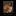
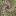

# Ilya-30u30

> til, Ilya sutskever gave john carmack this reading list of approx 30 research papers and said, ‘If you really learn all of these, you’ll know 90% of what matters today.’
> > [Ilya 30u30 arc.net folder](https://arc.net/folder/D0472A20-9C20-4D3F-B145-D2865C0A9FEE)

Here is the list of papers, blogs, books, and courses in the list of arc.net folder.

- You can run the `download.sh` script to download all the papers and books.
- All of the downloaded papers and books are in the `downloads` folder.

| Type | Name | Downloaded |
| :--: | ---- | :--------: |
| Blog |  [The Annotated Transformer](https://nlp.seas.harvard.edu/annotated-transformer/) | ❌ |
| Blog |  [The First Law of Complexodynamics](https://scottaaronson.blog/?p=762) | ❌ |
| Blog |  [The Unreasonable Effectiveness of RNNs](https://karpathy.github.io/2015/05/21/rnn-effectiveness/) | ❌ |
| Blog |  [Understanding LSTM Networks](https://colah.github.io/posts/2015-08-Understanding-LSTMs/) | ❌ |
| Paper |  [Recurrent Neural Network Regularization](https://arxiv.org/pdf/1409.2329.pdf) | ✅ |
| Paper |  [Keeping Neural Networks Simple by Minimizing the Description Length of the Weights](https://www.cs.toronto.edu/~hinton/absps/colt93.pdf) | ✅ |
| Paper |  [Pointer Networks](https://arxiv.org/pdf/1506.03134.pdf) | ✅ |
| Paper |  [ImageNet Classification with Deep CNNs](https://proceedings.neurips.cc/paper_files/paper/2012/file/c399862d3b9d6b76c8436e924a68c45b-Paper.pdf) | ✅ |
| Paper |  [Order Matters: Sequence to sequence for sets](https://arxiv.org/pdf/1511.06391.pdf) | ✅ |
| Paper |  [GPipe: Efficient Training of Giant Neural Networks using Pipeline Parallelism](https://arxiv.org/pdf/1811.06965.pdf) | ✅ |
| Paper |  [Deep Residual Learning for Image Recognition](https://arxiv.org/pdf/1512.03385.pdf) | ✅ |
| Paper |  [Multi-Scale Context Aggregation by Dilated Convolutions](https://arxiv.org/pdf/1511.07122.pdf) | ✅ |
| Paper |  [Neural Quantum Chemistry](https://arxiv.org/pdf/1704.01212.pdf) | ✅ |
| Paper |  [Attention Is All You Need](https://arxiv.org/pdf/1706.03762.pdf) | ✅ |
| Paper |  [Neural Machine Translation by Jointly Learning to Align and Translate](https://arxiv.org/pdf/1409.0473.pdf) | ✅ |
| Paper |  [Identity Mappings in Deep Residual Networks](https://arxiv.org/pdf/1603.05027.pdf) | ✅ |
| Paper |  [A Simple NN Module for Relational Reasoning](https://arxiv.org/pdf/1706.01427.pdf) | ✅ |
| Paper |  [Variational Lossy Autoencoder](https://arxiv.org/pdf/1611.02731.pdf) | ✅ |
| Paper |  [Relational RNNs](https://arxiv.org/pdf/1806.01822.pdf) | ✅ |
| Paper |  [Quantifying the Rise and Fall of Complexity in Closed Systems: The Coffee Automaton](https://arxiv.org/pdf/1405.6903.pdf) | ✅ |
| Paper |  [Neural Turing Machines](https://arxiv.org/pdf/1410.5401.pdf) | ✅ |
| Paper |  [Deep Speech 2: End-to-End Speech Recognition in English and Mandarin](https://arxiv.org/pdf/1512.02595.pdf) | ✅ |
| Paper |  [Scaling Laws for Neural LMs](https://arxiv.org/pdf/2001.08361.pdf) | ✅ |
| Book |  [A Tutorial Introduction to the Minimum Description Length Principle](https://arxiv.org/pdf/math/0406077.pdf) | ✅ |
| Book |  [Machine Super Intelligence Dissertation](https://www.vetta.org/documents/Machine_Super_Intelligence.pdf) | ✅ |
| Book |  [PAGE 434 onwards: Komogrov Complexity](https://www.lirmm.fr/~ashen/kolmbook-eng-scan.pdf) | ✅ |
| Course |  [CS231n Convolutional Neural Networks for Visual Recognition](https://cs231n.github.io/) | ❌ |
